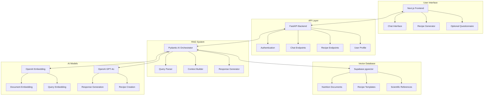

# Wise Nutrition: Project Planning Document

## 1. Vision Statement

Wise Nutrition is an AI-powered application designed to democratize nutrition knowledge through natural conversation and personalized recipe generation. It aims to help users understand their nutritional needs and address deficiencies through whole-food nutrition aligned with Weston A. Price principles.

## 2. Project Goals

- Create an agentic RAG system that provides accurate, science-based nutrition information
- Generate personalized, nutrient-dense recipes targeting specific deficiencies
- Build a user-friendly conversational interface that makes nutrition knowledge accessible
- Develop a system that prioritizes whole foods over supplements
- Integrate a questionnaire system to better understand user's nutritional profile

## 3. User Personas

### Health-Conscious Individual
- Wants to improve their nutrition through whole foods
- May have specific health goals or concerns
- Interested in the "why" behind nutritional recommendations

### Home Cook
- Looking for nutrient-dense recipes
- Wants to understand how cooking methods affect nutrition
- Interested in traditional food preparation methods

### Health Practitioner
- Needs a tool to recommend food-based solutions for clients
- Wants science-backed information with citations
- Values nuanced explanations over simplified answers

## 4. System Architecture

## 5. Tech Stack

### Frontend
- **Next.js**: React framework for the user interface
- **shadcn/ui**: Component library for consistent design
- **Supabase Auth**: Authentication and user management
- **Windsurf**: Real-time communication (if needed)

### Backend
- **FastAPI**: High-performance API framework
- **Pydantic**: Data validation using Python type hints
- **Pydantic AI**: Orchestration framework for LLM workflows
- **Supabase SDK**: Database interaction

### Data Storage & Retrieval
- **Supabase Postgres**: Primary database
- **pgvector extension**: Vector storage and similarity search
- **Row-Level Security**: Data access control

### AI & Machine Learning
- **OpenAI Embeddings**: Vectorize documents and queries
- **OpenAI GPT-4o**: Text generation and reasoning
- **Hybrid Search**: Combination of semantic and keyword search

### DevOps & Monitoring
- **Docker Compose**: Local development environment
- **Fly.io**: Deployment platform
- **Prometheus & Grafana**: Monitoring and analytics

## 6. Data Flow

1. **Ingestion Pipeline**:
   - Process nutrition documents (markdown, JSON)
   - Chunk documents for optimal retrieval
   - Generate embeddings
   - Store in Supabase pgvector

2. **User Query Flow**:
   - User submits question/request
   - Query is embedded and processed
   - Relevant context is retrieved
   - Response is generated with citations
   - (Optional) Follow-up questions are anticipated

3. **Recipe Generation Flow**:
   - System identifies nutritional needs
   - Retrieves appropriate recipe templates
   - Creates personalized recipe
   - Explains nutritional benefits

## 7. Agent Design

### Agent Components
1. **Query Understanding Agent**: Classify and parse user input
2. **Retrieval Agent**: Gather relevant context from vector database
3. **Reasoning Agent**: Process context and generate comprehensive answer
4. **Recipe Agent**: Generate personalized, nutrient-dense recipes
5. **Coordination Agent**: Orchestrate the workflow between specialized agents

### Agent Tools
- **Vector Search**: Semantic search in pgvector
- **Full-Text Search**: Keyword matching for specific terms
- **Hybrid Search**: Combine both approaches for optimal retrieval
- **User Profile**: Access user preferences and nutritional profile
- **Citation Manager**: Track and format source citations

## 8. Evaluation Strategy

- **RAG Evaluation**: Use RAGAS to evaluate retrieval quality
- **Response Quality**: Accuracy, helpfulness, scientifically sound
- **User Testing**: Collect feedback on response quality
- **Technical Metrics**: Latency, token usage, error rates
- **Nutrition Expert Review**: Validate nutritional advice accuracy

## 9. MVP Scope

### Phase 1: Basic RAG System
- Chat interface with nutrition knowledge base
- Basic citation system
- Minimal viable UI

### Phase 2: Recipe Generation
- Recipe generation based on direct requests
- Integration with nutrition knowledge

### Phase 3: User Profiles & Personalization
- User accounts and history
- Questionnaire for nutritional profiling
- Personalized recommendations

## 10. Security & Privacy Considerations

- **Authentication**: Secure login via Supabase Auth
- **Data Privacy**: Clear user data handling policies
- **GDPR Compliance**: Ensure user data rights
- **Responsible AI**: Monitor for potentially harmful advice

## 11. Integration & APIs

- **OpenAI API**: For embedding and text generation
- **Supabase API**: For database operations
- **Future Potential**: Nutrition databases, food tracking integrations

## 12. Performance Considerations

- **Query Caching**: Store common queries
- **Embedding Optimization**: Batch processing for efficiency
- **Rate Limiting**: Manage API usage costs
- **Response Time Target**: Under 3 seconds for RAG responses

## 13. Content Guidelines

- Focus on whole-food nutrition
- Align with Weston A. Price Foundation principles
- Emphasize traditional food preparation methods
- Prioritize food-based solutions over supplements
- Include citations for scientific claims
- Flag areas of scientific uncertainty or debate

## 14. Development Process

- **Git Workflow**: Feature branches + PR review
- **CI/CD**: Automated testing and deployment
- **Code Quality**: Enforced via linting and type checking
- **Documentation**: Maintained alongside code

## 15. References & Resources

- Weston A. Price Foundation materials
- Nourishing Traditions cookbook
- Scientific nutrition research papers
- Traditional culinary references
