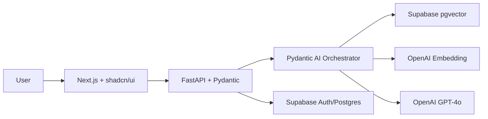

# wise_nutrition

> *AI‑powered chat & recipe generator for vitamin‑rich, whole‑food nutrition*

## Table of Contents
- [Features](#features)
- [Quick Start](#quick-start)
- [Architecture](#architecture)
- [Directory Structure](#directory-structure)
- [Data Format](#data-format)
- [Development & Testing](#development--testing)
- [Deployment](#deployment)
- [Contributing](#contributing)
- [License](#license)
- [PLANNING.md](#planningmd)
- [TASKS.md](#tasksmd)

## Features
- 💬 **Chatbot** answers nutrition questions with source citations (single disclaimer banner; no repetition)
- 🥗 **Recipe Generator** targets nutrient gaps using Weston A. Price–style dishes
- 📋 **Questionnaire** (optional) estimates likely deficiencies & personalises suggestions
- 🔍 **Hybrid Retrieval** via Supabase pgvector for semantic search
- ⚙️ **Pydantic AI Pipeline** — declarative orchestration & validation of LLM workflows
- 🔑 **Supabase Auth** (email / OAuth) with row‑level security

## Quick Start
```bash
# 1. Clone & enter repo
$ git clone git@github.com:your‑org/wise_nutrition.git && cd wise_nutrition

# 2. Create Python env
$ python -m venv .venv && source .venv/bin/activate
$ pip install -r requirements.txt

# 3. Spin up infrastructure
$ docker compose up -d supabase_emulator prometheus grafana

# 4. Ingest knowledge base
$ make ingest

# 5. Run API (FastAPI + Pydantic AI)
$ make api    # http://localhost:8000

# 6. Launch UI in Windsurf
$ make ui     # http://localhost:3000
```

## Architecture
See `PLANNING.md` for the detailed system diagram. High‑level:



## Directory Structure
```
.
├── data/                  # JSON + future scrubbed markdown
├── docs/                  # architecture diagrams, legacy docs
├── scripts/
│   ├── chunk.py           # split & normalise docs
│   ├── embed.py           # batch embed via Supabase SQL
│   └── eval.py            # RAGAS evaluation
├── server/
│   ├── main.py            # FastAPI entrypoint
│   ├── retrieval.py       # vector search abstraction
│   └── prompts.py         # prompt templates
├── ui/                    # Next.js frontend
├── PLANNING.md            # project plan
└── TASKS.md               # actionable task board
```

## Data Format
```jsonc
{
  "text": "Animal foods contain retinol…",
  "metadata": {
    "nutrient": "Vitamin A",
    "category": "symptoms",
    "source": "Nourishing Traditions, p. 123",
    "chunk_id": "vitamins__123_45",
    "origin": "manual"
  }
}
```

## Development & Testing
* **Linting**: `ruff .`
* **Unit Tests**: `pytest -q`
* **RAG Evaluation**: `make eval`

## Deployment
* **Local Dev**: Docker Compose (`supabase_emulator`, `prometheus`, `grafana`)
* **Hosted**: Fly.io deployment script in `scripts/deploy.sh`
* **Database & Auth**: Supabase hosted Postgres + Auth
* **Vector Store**: Supabase pgvector extension

## Contributing
Contributions welcome! Please open an issue or PR for major changes.

## License
MIT © 2025 Your‑Org

---

## PLANNING.md
> See separate `PLANNING.md` for full project plan, including goals, personas, technology stack, and roadmap.

## TASKS.md
> See separate `TASKS.md` for the detailed actionable task board.

